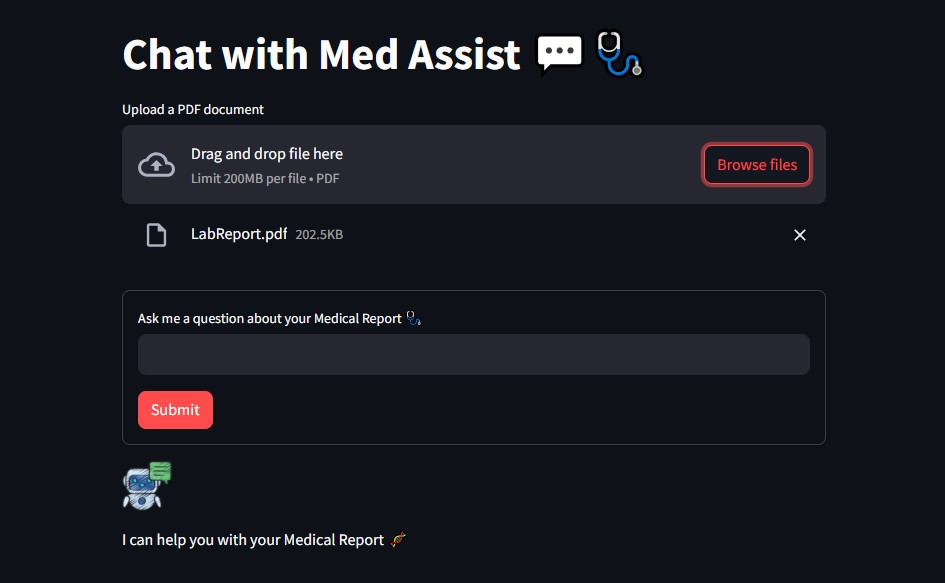

# Med-Assist-AI

This project uses Llama-index, a powerful retrieval-augmented generation tool, to fine-tune the GPT model. 
The goal was to create a sophisticated medical report analyzer capable of responding to user queries related to patient medical records. The front was created using Streamlit and it implements caching mechanisms for commonly accessed documents, optimizing the access time.

